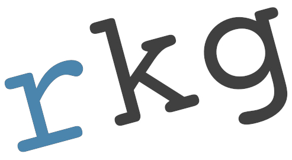

## [Beach Bum Report](https://beachbumreport.com)

The [Beach Bum Report](https://beachbumreport.com) is a project that is near to my heart. Being a local in Northwest Florida and having the skills to promote this area while making money at it is a blessing.

## [Gap Creek Media](https://gapcreekmedia.com)

I work with [Amanda Angell](https://amanda.world), the owner of [Gap Creek Media](https://gapcreekmedia.com), to foster a productive web presence and provide long-term technical management for all of our clients.

## [TOLCW](https://theofficialliberalconspiracywebsite.com)

[The Official Liberal Conspiracy Website](https://theofficialliberalconspiracywebsite.com) was created to support my politics. I have endured enough ant-Democratic and conspiracy theory bumper stickers that I felt motivated to invest a few dollars in my response. It's all in fun and healthy politics so don't go out of your way to be offended.

## [J-Make](https://richardkentgates.github.io/j-make/)

I noticed Brackets wasn't opening, then found it's development was falling behind. So I switched to using Kate on KDE and started writing to feel it out, and three days later I had [J-Make](https://richardkentgates.github.io/j-make/). *#CovidLife*

---

### Contact

Please use the contact form at [gapcreekmedia.com/contact-us/](https://gapcreekmedia.com/contact-us/)
